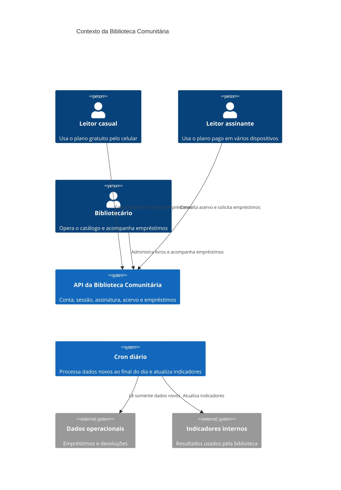
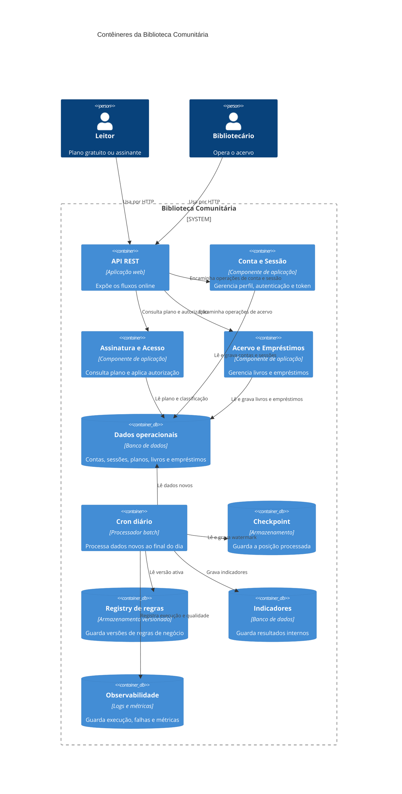
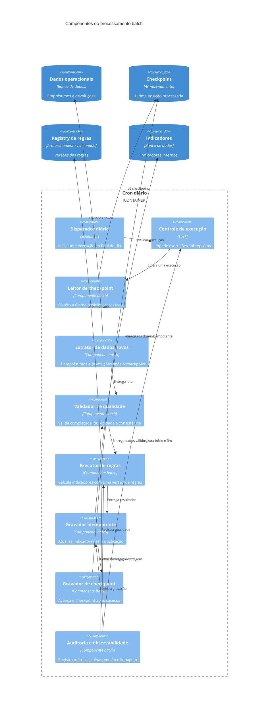
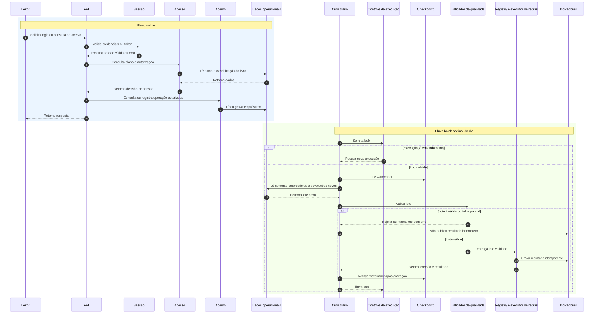

# Arquitetura

## 1. Contexto e objetivo

O sistema é uma API REST de uma biblioteca comunitária com dois planos de leitor: gratuito e assinante. O escopo está dividido em E1 Conta, E2 Sessão, E3 Assinatura e E4 Acervo.

O objetivo é permitir o cadastro e o uso de contas, o controle de sessões, a consulta do plano do leitor, o acesso ao acervo conforme o plano e a operação do catálogo e dos empréstimos. As fontes são [docs/personas.md](personas.md), [docs/prd.md](prd.md) e [docs/utility-tree.md](utility-tree.md).

### Fatos

1. O leitor casual quer pegar livros emprestados rapidamente pelo celular e pode estar em uma rede instável. Fonte: [docs/personas.md](personas.md), Marina Souza.
2. O leitor assinante usa vários dispositivos e espera não perder a sessão sem aviso. Fonte: [docs/personas.md](personas.md), Rafael Almeida.
3. O bibliotecário cadastra livros, classifica o acesso e acompanha empréstimos. Fonte: [docs/personas.md](personas.md), Helena Costa.
4. A API deve tratar conta, sessão, assinatura e acervo. Fonte: [docs/prd.md](prd.md), RF-01 a RF-12.
5. Existe plano gratuito e plano assinante. Fonte: [docs/prd.md](prd.md), RF-06 e RF-07.

### Lacunas, conflitos, suposições e perguntas abertas

1. Lacuna: os documentos não definem os campos completos de livro, leitor, empréstimo ou devolução.
2. Lacuna: os documentos não definem o formato, o algoritmo ou o armazenamento do token.
3. Lacuna: os documentos não definem a forma de pagamento, cancelamento ou renovação da assinatura.
4. Conflito: [docs/prd.md](prd.md), RNF-01, define até 500 milissegundos para consultas de perfil e acervo, enquanto RNF-07 define até 1 segundo para consultas públicas do acervo. A prioridade entre as metas não foi definida.
5. Conflito: a persona do leitor assinante espera aviso antes da expiração, mas [docs/prd.md](prd.md), RNF-03, define apenas expiração após 30 minutos e não define aviso.
6. Conflito de organização: RF-07 está ligado a E3 Assinatura, mas descreve acesso a livros exclusivos, que também depende de E4 Acervo.
7. Suposição a confirmar: o token emitido em RF-04 é o mecanismo usado para autorizar as operações protegidas.
8. Pergunta aberta: a API deve permitir renovação do token antes dos 30 minutos?
9. Pergunta aberta: o que caracteriza um empréstimo simultâneo para o cenário da utility tree?
10. Pergunta aberta: quais indicadores internos serão atualizados pelo processamento diário?

## 2. Stakeholders e personas

| Stakeholder ou persona | Interesse principal | Origem |
|---|---|---|
| Marina Souza, leitora casual | Pegar livros emprestados rapidamente pelo celular, inclusive com internet ruim. | [docs/personas.md](personas.md), seção 1 |
| Rafael Almeida, leitor assinante | Usar o acervo exclusivo em vários dispositivos sem expiração inesperada. | [docs/personas.md](personas.md), seção 2 |
| Helena Costa, bibliotecária da operação | Cadastrar livros, classificar o acesso e acompanhar empréstimos corretamente. | [docs/personas.md](personas.md), seção 3 |
| Biblioteca comunitária | Manter conta, sessão, assinatura, acervo e empréstimos funcionando conforme as regras do produto. | [docs/prd.md](prd.md), RF-01 a RF-12 |

## 3. Requisitos arquiteturalmente significativos

1. Autenticar o leitor por e-mail e senha e emitir token somente após login válido. Origem: [docs/prd.md](prd.md), RF-03 e RF-04.
2. Invalidar o token usado no logout. Origem: [docs/prd.md](prd.md), RF-05.
3. Expirar a sessão após 30 minutos sem renovação. Origem: [docs/prd.md](prd.md), RNF-03.
4. Suportar 100 usuários simultâneos na API. Origem: [docs/prd.md](prd.md), RNF-04.
5. Aplicar autorização conforme o plano do leitor para bloquear livros exclusivos ao plano gratuito. Origem: [docs/prd.md](prd.md), RF-07 e RNF-06.
6. Permitir ao bibliotecário cadastrar livros e definir se são públicos ou exclusivos. Origem: [docs/prd.md](prd.md), RF-10 e RF-11.
7. Registrar todas as alterações de classificação dos livros. Origem: [docs/prd.md](prd.md), RNF-08.
8. Responder às consultas de perfil e acervo em até 500 milissegundos em 95% das solicitações. Origem: [docs/prd.md](prd.md), RNF-01.
9. Responder às operações de login e logout em até 800 milissegundos em 95% das solicitações. Origem: [docs/prd.md](prd.md), RNF-02.
10. Manter disponibilidade mensal de 99,5%. Origem: [docs/prd.md](prd.md), RNF-05 e [docs/utility-tree.md](utility-tree.md), Confiabilidade e Disponibilidade.
11. Processar somente dados novos em um cron job executado diariamente ao final do dia, incluindo, por exemplo, empréstimos e devoluções do dia, e atualizar indicadores internos da biblioteca. Restrição obrigatória desta arquitetura; os documentos de requisitos não detalham os indicadores nem a forma de identificação dos dados novos.

## 4. Atributos de qualidade

| Atributo | Refinamento ou medida | Origem |
|---|---|---|
| Eficiência de Performance | 95% das consultas de livros públicos em menos de 1 segundo. | [docs/utility-tree.md](utility-tree.md), Eficiência de Performance, Tempo de resposta |
| Eficiência de Performance | Até 500 empréstimos simultâneos sem erro. | [docs/utility-tree.md](utility-tree.md), Eficiência de Performance, Capacidade |
| Confiabilidade | Disponibilidade de 99,5% por mês. | [docs/prd.md](prd.md), RNF-05; [docs/utility-tree.md](utility-tree.md), Confiabilidade |
| Confiabilidade | Recuperação em até 15 minutos após falha crítica. | [docs/utility-tree.md](utility-tree.md), Confiabilidade, Recuperação |
| Segurança | 100% das operações de cadastro e alteração de livros com autenticação válida. | [docs/utility-tree.md](utility-tree.md), Segurança, Autenticidade |
| Segurança | 100% dos livros exclusivos bloqueados para leitores gratuitos. | [docs/prd.md](prd.md), RNF-06; [docs/utility-tree.md](utility-tree.md), Segurança, Confidencialidade |
| Capacidade de Interação | 100% dos erros de sessão expirada devem informar a necessidade de novo login. | [docs/utility-tree.md](utility-tree.md), Capacidade de Interação |
| Manutenibilidade | 100% das alterações de classificação registradas. | [docs/prd.md](prd.md), RNF-08; [docs/utility-tree.md](utility-tree.md), Manutenibilidade |

## 5. Drivers priorizados

A priorização abaixo usa a combinação I e D registrada na utility tree. A utility tree não contém nenhum cenário com I A e D A; por isso, não há driver nessa combinação nos artefatos atuais.

| Prioridade | Driver | Origem |
|---|---|---|
| 1 | Proteger livros exclusivos contra acesso gratuito. | [docs/utility-tree.md](utility-tree.md), Segurança e Confidencialidade, I A, D M; [docs/prd.md](prd.md), RF-07 e RNF-06 |
| 2 | Manter mensagens claras quando a sessão expirar. | [docs/utility-tree.md](utility-tree.md), Capacidade de Interação e Clareza das mensagens, I A, D B; [docs/personas.md](personas.md), Rafael Almeida |
| 3 | Exigir autenticação em operações de cadastro e alteração de livros. | [docs/utility-tree.md](utility-tree.md), Segurança e Autenticidade, I A, D B; [docs/prd.md](prd.md), RF-10 e RF-11 |
| 4 | Manter disponibilidade de 99,5% por mês e recuperar o serviço em até 15 minutos. | [docs/utility-tree.md](utility-tree.md), Confiabilidade, I A, D M |
| 5 | Responder rapidamente às consultas de perfil e acervo. | [docs/prd.md](prd.md), RNF-01; [docs/utility-tree.md](utility-tree.md), Eficiência de Performance e Tempo de resposta, I A, D M |
| 6 | Suportar a capacidade prevista de empréstimos simultâneos. | [docs/utility-tree.md](utility-tree.md), Eficiência de Performance e Capacidade, I M, D A |
| 7 | Registrar alterações de classificação para análise da operação. | [docs/prd.md](prd.md), RNF-08; [docs/utility-tree.md](utility-tree.md), Manutenibilidade e Analisabilidade, I M, D M |

## 6. Glossário

| Termo | Definição no contexto dos artefatos |
|---|---|
| API REST | Sistema principal que expõe as operações da biblioteca. |
| Leitor casual | Persona com plano gratuito que busca empréstimos rápidos pelo celular. |
| Leitor assinante | Persona com plano pago que acessa o acervo exclusivo em vários dispositivos. |
| Bibliotecário | Persona responsável pelo cadastro, classificação do acervo e acompanhamento dos empréstimos. |
| Plano gratuito | Plano de leitor associado ao acesso a livros públicos. |
| Plano assinante | Plano de leitor associado ao acesso a livros exclusivos e públicos. |
| Token | Credencial retornada após login e usada para a sessão autenticada. Fonte: [docs/prd.md](prd.md), RF-04. |
| Acervo | Conjunto de livros públicos e exclusivos administrado pela biblioteca. |
| Livro público | Livro disponível para leitores do plano gratuito, conforme RF-08. |
| Livro exclusivo | Livro cujo acesso é permitido ao leitor assinante, conforme RF-07 e RF-09. |
| Empréstimo | Solicitação ou registro de uso de um livro por um leitor. Os campos completos não estão definidos nos artefatos. |
| Indicadores internos | Informações atualizadas pelo cron job diário. Os indicadores não foram especificados nos artefatos. |

## 7. Riscos iniciais

| Risco | Evidência ou origem | Impacto inicial |
|---|---|---|
| A diferença entre 500 milissegundos e 1 segundo pode gerar critérios de desempenho incompatíveis. | [docs/prd.md](prd.md), RNF-01 e RNF-07. | A equipe pode validar a mesma consulta com metas diferentes. |
| A expiração da sessão pode frustrar o assinante porque não existe regra de aviso prévio. | [docs/personas.md](personas.md), Rafael Almeida; [docs/prd.md](prd.md), RNF-03. | O usuário pode perder o acesso sem entender o motivo. |
| Uma classificação incorreta pode liberar livro exclusivo ou restringir livro público. | [docs/personas.md](personas.md), Helena Costa; [docs/prd.md](prd.md), RF-11. | Leitores podem receber acesso indevido ou perder acesso esperado. |
| A regra de dados novos do cron job não pode ser implementada com precisão sem definição de identificador e indicadores. | Restrição obrigatória desta arquitetura. | O processamento pode repetir dados ou deixar dados sem atualização. |
| A ausência de definição do token, da assinatura e dos empréstimos pode atrasar decisões de arquitetura. | Lacunas em [docs/prd.md](prd.md), RF-03 a RF-09. | Componentes e contratos podem precisar ser refeitos. |
| A disponibilidade de 99,5% e a recuperação em 15 minutos exigem operação e monitoramento ainda não definidos. | [docs/prd.md](prd.md), RNF-05; [docs/utility-tree.md](utility-tree.md), Recuperação. | O requisito pode não ser demonstrável ou sustentável. |

## 8. Responsabilidades e limites

| Parte | Responsabilidades | Limites |
|---|---|---|
| API REST | Receber solicitações, validar dados, autenticar leitores, autorizar operações, controlar sessão e expor conta, assinatura, acervo e empréstimos. | Não deve decidir indicadores internos nem processar novamente dados históricos no cron diário. |
| Conta | Cadastrar leitor, consultar perfil e atualizar perfil. | Não define acesso a livros exclusivos. A autorização depende do plano e do acervo. Origem: [docs/prd.md](prd.md), RF-01, RF-02 e RF-07. |
| Sessão | Autenticar e-mail e senha, emitir token, validar token, expirar sessão e executar logout. | Não define pagamento nem classificação de livros. Origem: [docs/prd.md](prd.md), RF-03 a RF-05 e RNF-03. |
| Assinatura e política de acesso | Consultar o plano gratuito ou assinante e decidir se o plano permite acessar um livro. | Não cadastra livros nem acompanha empréstimos. A forma de pagamento e renovação é uma lacuna. Origem: [docs/prd.md](prd.md), RF-06 e RF-07. |
| Acervo e empréstimos | Cadastrar livros, classificar livros, consultar livros, solicitar empréstimos e permitir acompanhamento operacional. | Não deve ignorar a autorização do plano. Origem: [docs/prd.md](prd.md), RF-08 a RF-12. |
| Processamento batch | Executar diariamente ao final do dia, selecionar somente dados novos, processar empréstimos e devoluções do dia e atualizar indicadores internos. | Não atende solicitações interativas e não deve alterar dados operacionais sem uma regra explícita. A restrição do cron é obrigatória; o restante desta responsabilidade é decisão arquitetural proposta. |
| Observabilidade e auditoria | Registrar falhas, duração, quantidade de dados processados, watermark, resultados dos indicadores e alterações de classificação. | Não substitui o registro funcional de empréstimos nem define indicadores de negócio. Parte desta responsabilidade não tem requisito explícito. |

### Limites da solução

1. O limite online compreende os recursos usados por leitores e bibliotecários durante a operação.
2. O limite batch compreende o cron diário, a leitura de dados novos, a atualização de indicadores e seus registros de execução.
3. A fonte operacional de empréstimos e devoluções deve ser separada logicamente do resultado dos indicadores. Essa separação é uma decisão arquitetural sem requisito explícito.
4. Pagamento, cancelamento e renovação da assinatura ficam fora do limite conhecido porque não foram definidos em [docs/prd.md](prd.md).
5. O conteúdo dos indicadores internos, sua retenção e seus consumidores ficam fora do limite definido e são perguntas abertas.

## 9. Interfaces lógicas

As interfaces abaixo são propostas para organizar responsabilidades. Os caminhos, formatos e códigos HTTP não foram definidos nos requisitos e não devem ser tratados como contrato final.

| Interface lógica | Consumidor | Provedor | Finalidade | Origem ou situação |
|---|---|---|---|---|
| Interface de conta | Leitor | Conta | Criar conta, consultar perfil e atualizar perfil. | RF-01 e RF-02 |
| Interface de sessão | Leitor | Sessão | Fazer login, receber token e executar logout. | RF-03 a RF-05 |
| Interface de plano | Leitor e política de acesso | Assinatura | Consultar o plano atual do leitor. | RF-06 |
| Interface de acervo | Leitor e bibliotecário | Acervo | Consultar livros, cadastrar livros e definir classificação. | RF-08 a RF-11 |
| Interface de empréstimos | Leitor e bibliotecário | Empréstimos | Solicitar e acompanhar empréstimos. | RF-08, RF-09 e RF-12 |
| Interface de dados novos | Processador batch | Fonte operacional | Ler empréstimos e devoluções novos, usando watermark ou checkpoint. | Restrição obrigatória do cron; decisão de interface sem requisito explícito |
| Interface de indicadores | Processador batch | Armazenamento de indicadores | Gravar os indicadores internos calculados. | Restrição obrigatória do cron; indicadores não definidos |
| Interface de regras | Processador batch | Registry de regras | Obter a versão das regras usadas no cálculo. | Decisão sem requisito explícito |

## 10. Diagramas

### 10.1 Contexto C4

### 10.2 Contêineres C4

### 10.3 Componentes C4

### 10.4 Sequência online e batch

## 11. Decisões do processamento batch

As decisões desta seção são propostas arquiteturais. Quando não há requisito ou atributo de qualidade que as sustente diretamente, isso está indicado como “sem requisito explícito”.

| Decisão | Proposta | Justificativa | Origem |
|---|---|---|---|
| Watermark ou checkpoint | Guardar uma posição processada, formada por um identificador ordenável ou por data e identificador, e ler somente registros posteriores. Atualizar o checkpoint apenas depois da gravação bem-sucedida dos indicadores. | Cumpre a restrição de processar somente dados novos, como empréstimos e devoluções do dia, e evita releitura normal. | Restrição obrigatória do cron. O tipo exato do checkpoint é sem requisito explícito. |
| Idempotência | Usar uma chave determinística do registro de origem, da versão da regra e do período, impedindo duplicação na atualização dos indicadores. | Permite reexecutar um lote sem duplicar resultados após falha ou retry. | Confiabilidade e recuperação em até 15 minutos em [docs/utility-tree.md](utility-tree.md); detalhe da chave sem requisito explícito. |
| Lock e concorrência | Adquirir um lock distribuído antes do início e liberar no fim ou na expiração controlada. Uma execução que não obtiver lock não deve processar dados. | Evita jobs sobrepostos e disputa pelo mesmo checkpoint. | RNF-04 exige 100 usuários simultâneos na API, mas não define concorrência batch. A decisão é sem requisito explícito. |
| Retry e recuperação | Repetir somente etapas seguras e idempotentes, com limite de tentativas; manter o checkpoint anterior quando houver falha parcial; permitir reprocessamento do lote. | Apoia a recuperação após falha sem perder dados novos nem duplicar indicadores. | Recuperação em até 15 minutos em [docs/utility-tree.md](utility-tree.md); número de tentativas e intervalo sem requisito explícito. |
| Qualidade e linhagem dos dados | Validar campos obrigatórios, duplicidade, datas, identificação da origem e relação entre empréstimo e devolução; registrar origem, lote, horário, versão da regra e resultado. | Reduz indicadores calculados com dados incompletos e permite explicar a origem do resultado. | Analisabilidade e registro de alterações em [docs/utility-tree.md](utility-tree.md); regras de dados e campos sem requisito explícito. |
| Reprodutibilidade | Fixar a versão das regras, o intervalo de dados, o checkpoint inicial, os parâmetros e a versão do lote em cada execução. | Permite repetir o cálculo e comparar resultados sem depender do estado atual das regras. | Manutenibilidade em [docs/utility-tree.md](utility-tree.md); decisão detalhada sem requisito explícito. |
| Validação dos indicadores | Comparar contagens de entrada e saída, verificar valores nulos e duplicados, comparar variação com a execução anterior e impedir publicação quando a validação falhar. | Evita publicar indicador incompleto ou claramente inconsistente. | Qualidade de dados é necessária pela restrição dos indicadores, mas os testes e limites são sem requisito explícito. |
| Versionamento e registry de regras de negócio | Armazenar regras com versão, data de vigência, autor, descrição e estado. Cada execução deve registrar a versão usada. | Torna o cálculo auditável e reprodutível quando uma regra mudar. | A utility tree exige analisabilidade; registry e seus campos são sem requisito explícito. |
| Promoção e rollback de novas regras | Promover uma regra após validação em dados de referência e manter a versão anterior disponível para rollback. O rollback não deve apagar resultados já publicados. | Reduz o impacto de uma regra nova incorreta e preserva a possibilidade de recuperação. | Recuperação da utility tree; processo de promoção e rollback sem requisito explícito. |
| Observabilidade | Registrar início, fim, duração, lock, checkpoint inicial e final, quantidade lida, rejeitada e gravada, versão da regra, erros e estado final. Alertar quando houver falha ou atraso. | Permite demonstrar execução, investigar falhas e verificar a disponibilidade da operação. | Disponibilidade de 99,5% em [docs/prd.md](prd.md), RNF-05, e recuperação da utility tree; alertas sem requisito explícito. |
| Segurança e LGPD | Restringir acesso aos dados do batch, criptografar dados sensíveis em trânsito e repouso, limitar dados pessoais aos necessários, registrar acesso e definir retenção antes da implementação. | Reduz exposição de dados de leitores e limita o uso do dado ao objetivo dos indicadores. | Segurança é atributo da utility tree; LGPD, retenção e controles específicos são sem requisito explícito. |
| Custos | Preferir processamento incremental pelo checkpoint, limitar retries, evitar reprocessamento integral e medir duração e volume antes de ampliar recursos. | O processamento incremental reduz trabalho repetido, mas o orçamento e a meta de custo não foram definidos. | Sem requisito explícito. Decisão baseada na restrição de processar somente dados novos. |

### Alternativas e suposições do batch

| Tema | Alternativa | Suposição necessária |
|---|---|---|
| Watermark | Usar timestamp mais identificador ou uma sequência monotônica da fonte. | A fonte possui ordenação estável e não altera registros já processados sem gerar nova versão. |
| Armazenamento | Manter checkpoint e indicadores no mesmo banco ou em armazenamentos separados. | O armazenamento escolhido oferece transação ou mecanismo equivalente para confirmar indicador e checkpoint de modo seguro. |
| Lock | Usar lock no banco ou serviço de lock distribuído. | Existe uma infraestrutura compartilhada por todas as instâncias que podem iniciar o cron. |
| Retry | Repetir automaticamente ou encaminhar o lote para tratamento manual após o limite. | O lote pode ser identificado e reprocessado sem mudar os dados de origem. |
| LGPD | Anonimizar ou pseudonimizar dados usados nos indicadores. | Os indicadores não precisam do identificador pessoal direto do leitor. Isso deve ser confirmado. |
| Regras | Promover uma versão por configuração ou por aprovação operacional. | Existe um responsável autorizado a aprovar a regra e definir sua vigência. |

As alternativas não são decisões finais. Os requisitos não informam o banco, a infraestrutura de execução, o volume real de dados, a retenção, os responsáveis pela aprovação ou a definição dos indicadores.

## 12. Avaliação ATAM independente

Esta avaliação foi feita somente com base em [docs/personas.md](personas.md), [docs/prd.md](prd.md) e nas seções anteriores deste arquivo. Números já definidos nos requisitos são tratados como evidências. Qualquer valor criado para tornar um cenário testável está marcado como hipótese pendente e não altera os requisitos.

### 12.1 Drivers identificados

| Driver | Evidência | Consequência arquitetural |
|---|---|---|
| Uso rápido pelo leitor casual | Marina usa o celular na rua e pode ter internet ruim. Fonte: [docs/personas.md](personas.md), seção 1. | O fluxo online precisa preservar a meta de resposta definida em RNF-01 e lidar com falhas de comunicação sem perder a operação. |
| Continuidade para o leitor assinante | Rafael usa vários dispositivos e não quer expiração sem aviso. Fonte: [docs/personas.md](personas.md), seção 2; [docs/prd.md](prd.md), RNF-03. | Sessão, aviso de expiração e disponibilidade precisam ser tratados conjuntamente. O aviso ainda é lacuna. |
| Correção operacional do acervo | Helena classifica livros e acompanha empréstimos sob prazo. Fonte: [docs/personas.md](personas.md), seção 3; [docs/prd.md](prd.md), RF-10 a RF-12. | Autorização, auditoria e consistência da classificação são essenciais. |
| Proteção do acervo exclusivo | Leitor assinante acessa livros exclusivos e leitor gratuito deve ser bloqueado. Fonte: [docs/prd.md](prd.md), RF-07 e RNF-06. | O plano deve ser verificado antes da entrega de dados exclusivos. |
| Processamento incremental diário | O cron deve executar ao final do dia, processar somente dados novos, como empréstimos e devoluções do dia, e atualizar indicadores internos. Fonte: restrição obrigatória registrada na arquitetura. | É necessário controlar fronteira de dados, reexecução, concorrência e qualidade. Os parâmetros ainda são hipóteses. |

### 12.2 Atributos prioritários

| Prioridade | Atributo | Motivo | Evidência |
|---|---|---|---|
| 1 | Segurança | Um erro permite acesso gratuito a livro exclusivo ou vazamento de dados de leitores. | [docs/prd.md](prd.md), RF-07 e RNF-06; [docs/utility-tree.md](utility-tree.md), Segurança. |
| 2 | Confiabilidade | A API deve permanecer disponível e o processamento diário não pode perder ou duplicar resultados. | [docs/prd.md](prd.md), RNF-05; [docs/utility-tree.md](utility-tree.md), Confiabilidade. A parte de duplicação do batch é hipótese arquitetural. |
| 3 | Eficiência de Performance | O leitor casual depende de uso rápido e há metas de resposta para perfil, acervo, login e logout. | [docs/personas.md](personas.md), Marina; [docs/prd.md](prd.md), RNF-01, RNF-02 e RNF-07. |
| 4 | Manutenibilidade | Mudanças de classificação precisam ser registradas e regras de indicadores precisam ser rastreáveis. | [docs/prd.md](prd.md), RNF-08; [docs/utility-tree.md](utility-tree.md), Manutenibilidade. |
| 5 | Capacidade de Interação | O assinante precisa entender a expiração da sessão. | [docs/personas.md](personas.md), Rafael; [docs/utility-tree.md](utility-tree.md), Clareza das mensagens. |

### 12.3 Utility tree da avaliação

O primeiro valor de cada par é Importância e o segundo é Dificuldade. A utility tree original não possui cenário I A e D A. Os cenários batch abaixo são cenários de avaliação e suas métricas novas são hipóteses pendentes.

| Prioridade | Atributo | Refinamento | Cenário | I | D | Situação da métrica |
|---|---|---|---|---|---|---|
| 1 | Confiabilidade | Disponibilidade | O cron executa ao final do dia enquanto leitores consultam o acervo, sem causar indisponibilidade além da meta online existente. | A | A | O impacto mensurável do batch no online é hipótese pendente. |
| 2 | Confiabilidade | Recuperação | Uma falha depois da leitura dos dados novos e antes da publicação dos indicadores permite reexecução sem perda nem duplicação. | A | A | Zero perda e zero duplicação são hipóteses pendentes. O prazo de recuperação de 15 minutos vem da utility tree original. |
| 3 | Confiabilidade | Consistência incremental | O cron lê empréstimos e devoluções novos depois do checkpoint e não reprocessa registros já confirmados. | A | A | A regra de somente dados novos é fato; a métrica de cobertura do lote é hipótese pendente. |
| 4 | Segurança | Proteção de dados pessoais | Um operador ou componente sem autorização tenta acessar dados pessoais de leitores usados no batch e não recebe esses dados. | A | A | 100% de bloqueio é hipótese pendente; RNF-06 trata livros, não dados pessoais. |
| 5 | Segurança | Confidencialidade | Um leitor gratuito tenta consultar um livro exclusivo durante o fluxo online e não recebe nenhum dado exclusivo. | A | M | 100% das tentativas já está em RNF-06. |
| 6 | Manutenibilidade | Rastreabilidade de regras | Um indicador pior que o anterior é identificado com a versão da regra e os dados de origem antes de ser publicado. | A | M | O limiar para considerar piora é hipótese pendente. |
| 7 | Eficiência de Performance | Tempo de resposta | Uma consulta de acervo ocorre enquanto o cron processa dados e continua atendendo a meta de resposta existente. | A | M | RNF-01 e RNF-07 são evidências; o impacto isolado do batch é hipótese pendente. |

### 12.4 Cenários priorizados

#### C-ATAM-01, proteção de livro exclusivo

| Parte | Conteúdo |
|---|---|
| Fonte | Leitor casual com plano gratuito. |
| Estímulo | Solicitar um livro classificado como exclusivo. |
| Ambiente | Fluxo online, leitor autenticado, plano gratuito e livro exclusivo disponível. |
| Artefato | API REST, sessão, plano e acervo. |
| Resposta | Recusar o acesso sem retornar dados do livro exclusivo. |
| Métrica | 100% das tentativas, conforme RNF-06. |
| Prioridade | Importância A, Dificuldade M. |
| Origem | [docs/prd.md](prd.md), RF-07 e RNF-06; [docs/personas.md](personas.md), Marina e Rafael. |

#### C-ATAM-02, online durante o batch

| Parte | Conteúdo |
|---|---|
| Fonte | Leitor casual e leitor assinante. |
| Estímulo | Consultar o acervo enquanto o cron executa o processamento diário. |
| Ambiente | Cron no final do dia, dados novos em processamento e API atendendo usuários. |
| Artefato | API REST, dados operacionais e processador batch. |
| Resposta | Atender a consulta sem bloquear ou degradar o acesso além das metas existentes. |
| Métrica | 95% das consultas de perfil e acervo em até 500 milissegundos, conforme RNF-01; o impacto específico do batch é hipótese pendente. |
| Prioridade | Importância A, Dificuldade A. |
| Origem | [docs/prd.md](prd.md), RNF-01; [docs/personas.md](personas.md), Marina e Rafael. |

#### C-ATAM-03, reexecução após falha parcial

| Parte | Conteúdo |
|---|---|
| Fonte | Operação da biblioteca. |
| Estímulo | Falhar depois da leitura de empréstimos e devoluções novos, mas antes da confirmação completa dos indicadores. |
| Ambiente | Execução batch com lote parcialmente processado. |
| Artefato | Checkpoint, processador batch, armazenamento de indicadores e observabilidade. |
| Resposta | Manter o checkpoint anterior, permitir retry e publicar o lote uma única vez após sucesso. |
| Métrica | Zero perda e zero duplicação são hipóteses pendentes; recuperação em até 15 minutos é a medida existente na utility tree. |
| Prioridade | Importância A, Dificuldade A. |
| Origem | Restrição do cron; [docs/utility-tree.md](utility-tree.md), Confiabilidade e Recuperação. |

#### C-ATAM-04, dados novos e checkpoint

| Parte | Conteúdo |
|---|---|
| Fonte | Cron diário. |
| Estímulo | Iniciar a execução no final do dia com empréstimos e devoluções novos e registros já processados em dias anteriores. |
| Ambiente | Dados operacionais com checkpoint persistido. |
| Artefato | Extrator incremental e armazenamento de checkpoint. |
| Resposta | Ler somente os registros novos, processá-los e avançar o checkpoint após a gravação válida. |
| Métrica | Nenhum registro anterior ao checkpoint deve ser selecionado; a forma de medir cobertura dos novos registros é hipótese pendente. |
| Prioridade | Importância A, Dificuldade A. |
| Origem | Restrição do cron; seção 11, decisão de watermark ou checkpoint. |

#### C-ATAM-05, indicador pior que o anterior

| Parte | Conteúdo |
|---|---|
| Fonte | Operador da biblioteca. |
| Estímulo | O cálculo do novo período produz indicador pior que o valor anterior. |
| Ambiente | Lote validado e regra de negócio versionada. |
| Artefato | Executor de regras, indicadores, registry e auditoria. |
| Resposta | Comparar o resultado, registrar a diferença e impedir ou permitir a publicação conforme regra aprovada. |
| Métrica | O limite de variação aceitável e a ação para piora são hipóteses pendentes. |
| Prioridade | Importância A, Dificuldade M. |
| Origem | Seção 11, validação dos indicadores, versionamento e registry; indicadores não definidos nos requisitos. |

#### C-ATAM-06, dados de leitores protegidos

| Parte | Conteúdo |
|---|---|
| Fonte | Componente ou operador sem autorização. |
| Estímulo | Tentar consultar dados pessoais de leitores usados no processamento dos indicadores. |
| Ambiente | Fluxo batch ou consulta operacional com controle de acesso ativo. |
| Artefato | Dados operacionais, processador batch e armazenamento de indicadores. |
| Resposta | Bloquear o acesso não autorizado e expor somente os dados necessários ao objetivo do indicador. |
| Métrica | Bloqueio de 100% das tentativas não autorizadas é hipótese pendente. |
| Prioridade | Importância A, Dificuldade A. |
| Origem | Seção 11, Segurança e LGPD; não há RNF específico para dados pessoais. |

### 12.5 Abordagens arquiteturais avaliadas

| Abordagem | Benefício esperado | Custo ou risco | Cenários relacionados | Situação |
|---|---|---|---|---|
| Processamento incremental com watermark ou checkpoint | Evita reprocessar dados antigos e atende à restrição de dados novos. | Depende de ordenação estável, persistência correta e tratamento de registros alterados. | C-ATAM-03 e C-ATAM-04. | Decisão proposta, sem formato definido no requisito. |
| Escrita idempotente dos indicadores | Permite reexecução após falha parcial sem duplicar resultados. | Exige chave determinística e política para mudança de regra. | C-ATAM-03. | Decisão proposta, sem requisito explícito para idempotência. |
| Lock antes da execução | Evita jobs sobrepostos e disputa pelo checkpoint. | Pode bloquear uma execução legítima se o lock não expirar corretamente. | Execução diária e C-ATAM-03. | Decisão proposta, sem requisito explícito. |
| Separação entre fluxo online e batch | Reduz competição entre consultas e processamento de indicadores. | Requer recursos, armazenamento ou limites operacionais separados, ainda não definidos. | C-ATAM-02. | Decisão proposta, sem métrica específica do batch. |
| Validação antes da publicação | Evita publicar lote degradado ou indicador inconsistente. | Pode atrasar a atualização ou impedir publicação quando o dado não for compreendido. | C-ATAM-03 e C-ATAM-05. | Decisão proposta, sem regras de validação definidas. |
| Registry de regras com versão e rollback | Permite rastrear, repetir e reverter cálculo. | Exige governança, aprovação e retenção de versões. | C-ATAM-05. | Decisão proposta, sem requisito explícito. |
| Minimização e pseudonimização de dados | Reduz exposição de dados pessoais no batch. | Pode impedir análises que dependam de identificação direta. | C-ATAM-06. | Decisão proposta, LGPD não especificada nos requisitos. |

## 13. Análise dos pontos solicitados

| Ponto | Avaliação ATAM | Evidência, hipótese ou lacuna |
|---|---|---|
| Execução diária do cron | O disparo deve ocorrer ao final do dia e gerar uma execução identificável, com início, fim e estado. A falha deve ser visível e não deve avançar o checkpoint sem publicação válida. | A periodicidade e o momento são restrição obrigatória. O horário exato, o fuso e a política de atraso são lacunas. Relaciona-se a C-ATAM-03 e C-ATAM-04. |
| Dados novos | O batch deve selecionar registros posteriores ao checkpoint e incluir empréstimos e devoluções do dia conforme a restrição. Registros atrasados ou corrigidos exigem regra ainda não definida. | Fato: somente dados novos. Hipótese: watermark por identificador ou data mais identificador. Relaciona-se a C-ATAM-04. |
| Falha parcial | O lote deve permanecer identificável, o checkpoint anterior deve ser preservado e o retry deve ser idempotente. A publicação parcial não deve ser confundida com sucesso. | A recuperação em até 15 minutos vem da utility tree. Zero perda, zero duplicação e limite de retries são hipóteses. Relaciona-se a C-ATAM-03. |
| Jobs sobrepostos | Uma execução deve adquirir lock antes de ler ou avançar o checkpoint. A segunda execução deve sair sem processar dados ou aguardar uma política definida. | O lock é decisão proposta sem requisito explícito. Expiração, dono do lock e comportamento da segunda execução são lacunas. |
| Degradação dos dados | O sistema deve verificar campos obrigatórios, duplicidade, datas e vínculo entre empréstimo e devolução antes do cálculo. Dados inválidos devem ser separados e contabilizados. | A necessidade decorre da qualidade e linhagem propostas. Campos e limites de erro não estão em [docs/prd.md](prd.md). |
| Indicador pior que o anterior | O resultado deve ser comparado ao anterior e a diferença registrada. Não se deve bloquear ou publicar automaticamente sem uma regra de negócio aprovada para a piora. | O indicador e o limiar de piora não foram definidos. C-ATAM-05 é hipótese de avaliação, não requisito. |
| Rollback | A versão anterior da regra deve permanecer disponível e o rollback deve selecionar a versão usada, sem apagar o histórico de execução. | Rollback é abordagem proposta com base em recuperação e manutenibilidade; não há requisito de aprovação, prazo ou efeito sobre indicadores já publicados. |
| Indisponibilidade do online durante o batch | O batch não deve assumir exclusividade sobre os recursos online. A API deve continuar atendendo as metas existentes, e o impacto real precisa ser medido. | RNF-01, RNF-02, RNF-04, RNF-05 e RNF-07 existem, mas não medem o efeito do batch. Relaciona-se a C-ATAM-02. |
| Vazamento de dados de leitores | O acesso ao batch deve ser restrito, os dados devem ser minimizados e os indicadores devem evitar identificadores pessoais quando não necessários. | Segurança existe como atributo, mas LGPD, retenção e controle de acesso a dados pessoais não estão especificados. C-ATAM-06 é hipótese de avaliação. |

## 14. Pontos de sensibilidade

1. O checkpoint é o principal ponto de sensibilidade do batch. Se sua fronteira estiver errada, o sistema pode ignorar empréstimos novos ou processar registros antigos novamente. Relação: decisão de watermark e C-ATAM-04.
2. O compartilhamento de recursos entre online e batch é sensível para a performance. Se o cron consumir recursos concorrentes em excesso, pode afetar RNF-01, RNF-02 ou RNF-07. O volume que causaria impacto ainda é hipótese pendente. Relação: C-ATAM-02.
3. A regra que decide quando um indicador piorou é sensível para manutenibilidade e operação. Um limiar inadequado pode publicar um resultado degradado ou bloquear um resultado válido. Relação: C-ATAM-05.

## 15. Trade-offs

1. Separar recursos online e batch pode preservar performance e disponibilidade, mas aumenta custo operacional e complexidade. A separação é proposta, e o orçamento não foi definido. Relação: C-ATAM-02 e a decisão de custos da seção 11.
2. Validar mais dados e manter mais linhagem melhora confiabilidade e analisabilidade, mas pode atrasar a publicação dos indicadores. Relação: C-ATAM-03 e C-ATAM-05.
3. Pseudonimizar leitores reduz exposição de dados, mas pode dificultar investigações operacionais que dependam de identificação direta. Relação: C-ATAM-06.

## 16. Riscos e temas de risco

| Risco ou tema | Consequência | Relação | Estado |
|---|---|---|---|
| Registros atrasados depois do checkpoint | Empréstimo ou devolução pode ficar fora do indicador diário. | C-ATAM-04; decisão de watermark. | Lacuna sobre dados atrasados. |
| Avanço prematuro do checkpoint | Falha parcial pode causar perda lógica de dados. | C-ATAM-03. | Decisão proposta, ainda não implementada. |
| Lock sem expiração segura | Um job interrompido pode impedir as execuções seguintes. | Execução diária e jobs sobrepostos. | Hipótese de operação. |
| Dados degradados de origem | Indicadores podem ficar incorretos ou incompletos. | C-ATAM-05; decisão de qualidade. | Campos e limites não definidos. |
| Regra nova incorreta | Indicador pode piorar por lógica, e não por mudança real da operação. | C-ATAM-05; registry e rollback. | Processo de promoção não definido. |
| Competição com fluxo online | Consultas podem ultrapassar as metas de resposta ou a API pode ficar indisponível. | C-ATAM-02; RNF-01, RNF-02, RNF-05 e RNF-07. | Impacto do batch não medido. |
| Exposição de dados pessoais | Violação de confidencialidade e uso além do necessário. | C-ATAM-06; segurança e LGPD. | Controles e retenção não definidos. |
| Ausência de orçamento | A abordagem escolhida pode ser tecnicamente adequada, mas financeiramente inviável. | Decisão de custos da seção 11. | Sem requisito explícito. |

## 17. Não riscos atuais

1. O fato de o cron processar somente dados novos não é, por si só, um risco: é uma restrição confirmada. O risco está em não definir como identificar esses dados. Relação: C-ATAM-04.
2. A existência de dois planos não é, por si só, um risco arquitetural: ela está definida em RF-06 e RF-07. O risco está em falhar na autorização de livros exclusivos. Relação: C-ATAM-01.
3. O processamento diário não é, por si só, uma ameaça à disponibilidade. A ameaça depende da competição por recursos e da ausência de isolamento ou controle. Relação: C-ATAM-02.

## 18. Conclusão da avaliação

Os maiores pontos de atenção são a fronteira de dados novos, a recuperação idempotente após falha parcial, a concorrência entre batch e online e a proteção de dados de leitores. As abordagens apresentadas são hipóteses de arquitetura, não decisões confirmadas pelos requisitos.

Antes de transformar as hipóteses em compromissos, permanecem necessárias definições sobre horário e fuso do cron, dados atrasados ou corrigidos, indicadores, regras de piora, aprovação e rollback, retenção de dados pessoais, infraestrutura compartilhada e metas específicas do batch.

## 19. Revisão do painel

As posições abaixo são objeções independentes. Nenhuma delas altera os requisitos.

| Papel | Objeção fundamentada |
|---|---|
| Arquiteto | O limite entre fluxo online e batch está descrito, mas o isolamento de recursos ainda é uma proposta. Sem uma decisão de concorrência, não há evidência de que o cron preserve RNF-01, RNF-05 e RNF-07. |
| Especialista em dados | O checkpoint resolve a leitura incremental apenas se a fonte tiver ordenação estável e tratamento para registros atrasados ou corrigidos. Essas condições não existem nos requisitos. |
| Segurança e LGPD | RNF-06 protege livros exclusivos, mas não protege explicitamente dados pessoais de leitores. A arquitetura propõe minimização, mas não há finalidade, retenção, perfis de acesso ou base documental definidos. |
| Operações | A recuperação em 15 minutos é uma meta da utility tree, porém horário, fuso, alertas, dono do job e comportamento após falha não estão definidos. Não é possível confirmar a operação diária apenas pelo diagrama. |
| Custos | Checkpoint, retries limitados e processamento incremental tendem a reduzir trabalho, mas lock distribuído, registry, observabilidade e isolamento podem aumentar custo. Não há orçamento ou limite de custo para decidir o equilíbrio. |
| Facilitador ATAM | A utility tree original não possui cenário com I A e D A nem cenário específico do batch. Os cenários ATAM completam a análise, mas são hipóteses e não requisitos aprovados. |

### Divergências consolidadas

1. O arquiteto prioriza isolamento para proteger o online; custos questiona se a infraestrutura adicional é aceitável. Resolução provisória: tratar isolamento como alternativa a validar, não como decisão fechada.
2. Dados prioriza um checkpoint rigoroso; operações precisa de recuperação e reexecução. Resolução provisória: só avançar o checkpoint após publicação válida e testar registros atrasados antes de fixar o formato.
3. Segurança exige proteção de dados pessoais; dados e operação precisam de indicadores úteis. Resolução provisória: usar somente os dados necessários e manter a decisão de anonimização ou pseudonimização pendente.
4. ATAM considera zero perda e zero duplicação importantes; os requisitos não definem essas métricas. Resolução provisória: tratá-las como hipóteses de aceite experimental.

## 20. Verificação de coerência dos modelos

| Verificação | Resultado | Divergência ou consequência |
|---|---|---|
| Contexto C4 e contêineres | Parcialmente coerentes. | Ambos mostram API, cron, dados operacionais e indicadores, mas o contexto não mostra checkpoint, registry e observabilidade. Isso é diferença de nível, não erro, mas reduz a rastreabilidade visual. |
| Contêineres C4 e componentes C4 | Coerentes como proposta. | Os componentes do batch correspondem ao cron, checkpoint, registry, indicadores e observabilidade. Os tipos de armazenamento continuam sem tecnologia definida. |
| Componentes C4 e sequência | Parcialmente coerentes. | A sequência mostra lock, checkpoint, qualidade, regras e indicadores, mas não mostra a auditoria em cada etapa nem o retry explícito. |
| Sequência online e requisitos | Parcialmente coerentes. | Mostra autenticação, autorização e acervo, mas não mostra criação de conta, logout, bibliotecário ou invalidação de token. |
| Sequência batch e pipeline | Incompleta para falha parcial. | Mostra lote inválido e publicação válida, mas não mostra falha depois de uma escrita parcial nem a reexecução idempotente. |
| Utility tree original e riscos | Incompletos para o cron. | A utility tree original trata performance, confiabilidade, segurança e manutenibilidade, mas não define cenário específico para checkpoint, dados atrasados ou indicadores. |
| Utility tree ATAM e riscos | Coerentes como análise adicional. | Os cenários C-ATAM-02 a C-ATAM-06 cobrem os riscos batch, porém as métricas novas estão marcadas como hipóteses pendentes. |

## 21. ADRs

Os ADRs seguintes são propostas para avaliação. Não são decisões implementadas nem alteram a fonte de verdade.

### ADR-001: Processamento incremental por checkpoint

**Contexto:** O cron deve executar diariamente ao final do dia e processar somente dados novos, como empréstimos e devoluções do dia.

**Forças:** Reduz releitura, torna o lote identificável e atende diretamente à restrição do cron.

**Alternativas:** Usar timestamp mais identificador, sequência monotônica da fonte ou leitura integral com filtragem posterior.

**Decisão:** Preferir um checkpoint persistido e selecionar registros posteriores a ele. Avançar o checkpoint somente depois da gravação válida dos indicadores.

**Consequências:** Exige ordenação estável, tratamento de registros atrasados e registro do checkpoint inicial e final.

**Riscos:** Registros corrigidos ou atrasados podem ficar fora do lote se a fonte não tiver uma regra de reapresentação.

**Requisitos atendidos:** Restrição obrigatória do cron; C-ATAM-04; confiabilidade e recuperação da [docs/utility-tree.md](utility-tree.md). O formato do checkpoint é sem requisito explícito.

### ADR-002: Escrita idempotente e lock de execução

**Contexto:** Uma falha pode provocar reexecução, e duas execuções podem disputar o mesmo lote.

**Forças:** Evita duplicação e jobs sobrepostos, preservando o checkpoint e os indicadores.

**Alternativas:** Não usar lock e confiar no scheduler; usar lock no banco; usar serviço de lock distribuído; aceitar duplicação para correção posterior.

**Decisão:** Usar lock antes da leitura e chave determinística na escrita dos indicadores. Uma execução sem lock não processa dados.

**Consequências:** Acrescenta controle operacional e exige definição de expiração do lock, dono da execução e chave idempotente.

**Riscos:** Lock preso pode impedir o cron seguinte; chave inadequada pode tratar duas versões como o mesmo resultado.

**Requisitos atendidos:** Apoia C-ATAM-03 e C-ATAM-04, a recuperação em até 15 minutos da utility tree e a disponibilidade operacional. Lock e idempotência não possuem requisito explícito.

### ADR-003: Gates de qualidade antes da publicação

**Contexto:** O cron atualiza indicadores, mas os documentos não definem campos, indicadores ou limites de qualidade.

**Forças:** Evita publicar lotes incompletos, duplicados ou incoerentes e cria evidência para investigação.

**Alternativas:** Publicar sempre e corrigir depois; rejeitar o lote inteiro; separar registros inválidos e publicar somente os válidos.

**Decisão:** Validar completude, duplicidade, datas, origem e relação entre empréstimo e devolução. Bloquear a publicação quando um gate obrigatório falhar.

**Consequências:** Pode atrasar indicadores e exige catálogo de erros, política para registros inválidos e responsáveis pela decisão.

**Riscos:** Um gate muito rígido pode bloquear dados úteis; um gate permissivo pode publicar indicador degradado.

**Requisitos atendidos:** Apoia manutenibilidade, analisabilidade, C-ATAM-03 e C-ATAM-05. Os gates e seus limites são sem requisito explícito.

### ADR-004: Registry, promoção e rollback de regras

**Contexto:** Um indicador pode piorar por mudança real ou por mudança na regra de cálculo. A arquitetura já prevê registry e versionamento como proposta.

**Forças:** Permite saber qual regra produziu um resultado, repetir o cálculo e retornar à versão anterior.

**Alternativas:** Manter regras somente no código; alterar regra diretamente em produção; usar configuração versionada sem aprovação formal.

**Decisão:** Manter regras versionadas com vigência, autor, descrição e estado. Promover após validação com dados de referência e manter a versão anterior para rollback.

**Consequências:** Exige governança, aprovação, dados de referência e decisão sobre o tratamento de indicadores já publicados.

**Riscos:** Uma regra aprovada com dados de referência inadequados pode produzir indicadores incorretos; rollback pode gerar séries não comparáveis.

**Requisitos atendidos:** Apoia RNF-08, manutenibilidade, C-ATAM-05 e recuperação. Registry, promoção e rollback não possuem requisito explícito.

### ADR-005: Proteção do fluxo online contra o batch

**Contexto:** Leitores e bibliotecários usam a API enquanto o cron processa dados. RNF-01, RNF-02, RNF-04, RNF-05 e RNF-07 definem metas para o online, mas não medem o impacto do batch.

**Forças:** Preserva resposta e disponibilidade para Marina, Rafael e Helena.

**Alternativas:** Compartilhar todos os recursos; limitar o batch por configuração; separar recursos online e batch; executar o batch em janela sem usuários.

**Decisão:** Tratar separação ou limitação de recursos como alternativa prioritária para experimento, sem fechá-la como decisão final antes de medir o impacto.

**Consequências:** Isolamento pode aumentar custo e complexidade; limitação pode prolongar o batch.

**Riscos:** Sem isolamento, o online pode degradar; com isolamento excessivo, o custo pode ser incompatível com a operação.

**Requisitos atendidos:** C-ATAM-02, RNF-01, RNF-04, RNF-05 e RNF-07. A forma de isolamento e o orçamento são sem requisito explícito.

### ADR-006: Segurança, LGPD e custo do batch

**Contexto:** O batch pode ler empréstimos, devoluções e dados de leitores para produzir indicadores. Os requisitos protegem livros exclusivos, mas não definem controles de dados pessoais, retenção ou custo.

**Forças:** Minimização, controle de acesso, registro de acesso e pseudonimização reduzem exposição; processamento incremental reduz trabalho repetido.

**Alternativas:** Copiar todos os dados pessoais; usar somente identificadores necessários; anonimizar indicadores; pseudonimizar dados e manter vínculo protegido.

**Decisão:** Usar somente os dados necessários, restringir acessos e avaliar anonimização ou pseudonimização antes da implementação. Medir custo por execução antes de ampliar recursos.

**Consequências:** Pode limitar investigações e exige definição de finalidade, retenção, perfis de acesso e responsáveis.

**Riscos:** Minimização insuficiente pode causar vazamento; anonimização inadequada pode impedir operação; controles adicionais podem aumentar custo.

**Requisitos atendidos:** C-ATAM-06, atributo Segurança e decisão de custos da seção 11. LGPD, custo, retenção e controles específicos são sem requisito explícito.

## 22. Confirmação das decisões críticas

| Ponto | Confirmação do painel | Estado |
|---|---|---|
| Watermark | É a abordagem proposta para selecionar somente dados posteriores ao último processamento confirmado. O formato e o tratamento de atrasos ainda não estão decididos. | Hipótese arquitetural |
| Idempotência | É necessária para reexecução não duplicar indicadores. A chave determinística ainda não foi definida. | Hipótese arquitetural |
| Lock | É recomendado antes da leitura e escrita do lote para impedir jobs sobrepostos. Expiração e infraestrutura ainda não foram definidas. | Hipótese arquitetural |
| Retry | Deve repetir apenas etapas idempotentes e manter o checkpoint anterior em falha parcial. Limite, intervalo e tratamento manual ainda não foram definidos. | Hipótese arquitetural |
| Gates de validação | Devem bloquear a publicação quando qualidade obrigatória falhar. Campos, limites e política de dados inválidos ainda não foram definidos. | Hipótese arquitetural |
| Registry de regras | Deve guardar a versão usada por cada indicador. Campos, armazenamento e governança ainda não foram definidos. | Hipótese arquitetural |
| Promoção e rollback | Deve validar nova regra antes da promoção e manter a versão anterior. O processo de aprovação e o efeito sobre indicadores publicados estão em aberto. | Hipótese arquitetural |
| Observabilidade | Deve registrar execução, checkpoint, volume, erros, qualidade, versão e estado final. Alertas, retenção e responsáveis ainda não foram definidos. | Hipótese arquitetural |
| LGPD | Deve limitar acesso e dados pessoais ao necessário, com avaliação de anonimização ou pseudonimização. Não há requisito específico de LGPD no PRD. | Decisão proposta sem requisito explícito |
| Custo | Deve favorecer processamento incremental e medir duração e volume antes de ampliar recursos. Não há orçamento ou meta de custo. | Decisão proposta sem requisito explícito |

## 23. Matriz de rastreabilidade

| Requisito | Decisão relacionada | Componente ou limite | Evidência |
|---|---|---|---|
| RF-01 | Validação de conta | API REST e Conta | RF-01; seção 8 |
| RF-02 | Autorização por sessão | API REST, Conta e Sessão | RF-02; RF-03; seção 9 |
| RF-03 | Autenticação | Sessão | RF-03; seção 3 |
| RF-04 | Emissão de token | Sessão | RF-04; seção 3 |
| RF-05 | Invalidação no logout | Sessão | RF-05; seção 3 |
| RF-06 | Consulta de plano | Assinatura e política de acesso | RF-06; seção 9 |
| RF-07 | Autorização por plano | Assinatura, política de acesso e Acervo | RF-07 e RNF-06; C-ATAM-01 |
| RF-08 | Consulta e solicitação de livro público | Acervo e empréstimos | RF-08; C-ATAM-02 |
| RF-09 | Consulta e solicitação por assinante | Assinatura, política de acesso e Acervo | RF-09; RF-07 |
| RF-10 | Cadastro de livro | Acervo e empréstimos | RF-10; seção 8 |
| RF-11 | Classificação de livro e auditoria | Acervo, auditoria e observabilidade | RF-11 e RNF-08; seção 11 |
| RF-12 | Consulta de empréstimos | Acervo e empréstimos | RF-12; seção 9 |
| RNF-01 | Proteção do online durante batch | API REST e limite online | RNF-01; C-ATAM-02 |
| RNF-02 | Controle do fluxo de sessão | Sessão | RNF-02; seção 3 |
| RNF-03 | Expiração de sessão | Sessão | RNF-03; seção 3 |
| RNF-04 | Controle de concorrência online | API REST e limite online | RNF-04; seção 8 |
| RNF-05 | Disponibilidade e observabilidade | API REST, processamento batch e observabilidade | RNF-05; C-ATAM-02 |
| RNF-06 | Bloqueio de livro exclusivo | Política de acesso e Acervo | RNF-06; C-ATAM-01 |
| RNF-07 | Tempo de resposta do acervo | API REST e Acervo | RNF-07; C-ATAM-02 |
| RNF-08 | Registro de classificação | Acervo e auditoria | RNF-08; seção 8 |
| Restrição do cron | Checkpoint, idempotência, lock, gates e observabilidade | Limite batch e componentes do cron | Seção 3, seção 10, C-ATAM-03 e C-ATAM-04 |

### Requisitos sem cobertura arquitetural suficiente

1. RF-01 não define os campos de conta, regras de senha ou comportamento para e-mail já cadastrado.
2. RF-02 não define os campos do perfil nem conflitos de atualização.
3. RF-06, RF-07 e RF-09 não definem como o plano assinante é criado, renovado, cancelado ou validado quando a mensalidade muda.
4. RF-08, RF-09 e RF-12 não definem disponibilidade, devolução, conflito de empréstimo ou campos completos do empréstimo.
5. RNF-01 e RNF-07 têm metas diferentes para consultas de acervo e a prioridade entre 500 milissegundos e 1 segundo não está resolvida.
6. RNF-03 não define aviso ao leitor antes da expiração, embora a persona de Rafael espere esse aviso.
7. RNF-05 não define como medir disponibilidade, janela de manutenção, dependências ou impacto do batch.
8. A restrição do cron não define indicadores, dados atrasados, horário e fuso, retenção, volume ou critério de sucesso do lote.

### Decisões sem requisito explícito

1. Formato do watermark ou checkpoint.
2. Chave de idempotência.
3. Tipo, expiração e dono do lock.
4. Quantidade e intervalo de retries.
5. Gates, limites e tratamento de dados inválidos.
6. Campos e armazenamento do registry de regras.
7. Critério de promoção, aprovação e rollback.
8. Isolamento entre recursos online e batch.
9. Logs, alertas, retenção de observabilidade e responsáveis pela resposta.
10. Controles de LGPD, anonimização, pseudonimização e retenção de dados pessoais.
11. Orçamento e limite de custo.

### Suposições a confirmar

1. A fonte operacional tem uma posição ordenável e persistente para identificar dados novos.
2. Registros de empréstimo ou devolução não são alterados depois do checkpoint sem uma nova versão identificável.
3. O armazenamento permite confirmar resultado e checkpoint em uma ordem segura.
4. O batch pode acessar os dados operacionais sem bloquear as operações online.
5. Indicadores não precisam do identificador pessoal direto do leitor.
6. Existe um responsável por aprovar e reverter regras de negócio.
7. Há um ambiente em que o cron pode ser observado e reexecutado com segurança.

### Perguntas abertas

1. Qual é o horário exato e o fuso do cron?
2. Como tratar empréstimos e devoluções atrasados, corrigidos ou recebidos fora da janela do dia?
3. Quais indicadores serão produzidos e quem os consumirá?
4. O que significa um indicador pior que o anterior e qual ação deve ocorrer?
5. Qual é a chave estável de empréstimo e devolução?
6. O lock ficará no banco ou em outro serviço, e qual será sua expiração?
7. Quantas tentativas de retry serão permitidas e quando haverá intervenção manual?
8. Quais dados pessoais entram no cálculo, por quanto tempo serão mantidos e quem pode acessá-los?
9. Qual é o orçamento mensal ou por execução para o batch?
10. Como será avisado o leitor assinante antes da expiração da sessão?

### Riscos aceitos provisoriamente

Esta aceitação é apenas uma posição de revisão. Não há evidência de aprovação formal por um responsável do projeto.

1. Aceita-se provisoriamente não definir tecnologia de banco, scheduler ou lock enquanto os requisitos de dados e operação não forem esclarecidos. Relação: ADR-001 e ADR-002.
2. Aceita-se provisoriamente que as métricas de zero perda, zero duplicação e impacto do batch sejam hipóteses de experimento, não critérios de produção. Relação: C-ATAM-02, C-ATAM-03 e C-ATAM-04.
3. Aceita-se provisoriamente manter a regra de sessão sem aviso definido, pois RNF-03 só determina 30 minutos. O risco para Rafael permanece aberto. Relação: RNF-03 e Capacidade de Interação.
4. Aceita-se provisoriamente não fixar orçamento até medir volume e duração. Relação: ADR-006.

### Próximos experimentos

1. Executar um lote representativo com registros novos, antigos, atrasados e duplicados para comparar watermark por timestamp mais identificador com sequência monotônica. Medir cobertura, repetição e tempo. Os limites são hipóteses pendentes.
2. Interromper o batch em cada etapa, inclusive depois da escrita parcial, e verificar reexecução, checkpoint, duplicação e recuperação. Usar zero perda e zero duplicação como hipótese de aceite.
3. Iniciar duas execuções simultâneas e observar lock, expiração e comportamento da segunda execução. Registrar o tempo de espera e o estado final.
4. Executar consultas online durante o batch e comparar RNF-01, RNF-02 e RNF-07 com e sem limitação ou isolamento de recursos. O impacto aceitável do batch ainda é hipótese.
5. Inserir dados incompletos, inconsistentes e duplicados para validar os gates e medir rejeições. Definir os limites somente após análise com a operação.
6. Calcular o mesmo lote com duas versões de regra, promover uma versão e simular rollback. Verificar rastreabilidade e comparabilidade dos indicadores.
7. Testar acesso de perfis autorizados e não autorizados aos dados pessoais do batch, avaliando minimização, anonimização ou pseudonimização. A política de retenção deve ser definida antes de um teste de produção.
8. Medir duração, volume processado e recursos consumidos em execução incremental e reprocessamento. Comparar o custo estimado sem assumir orçamento ainda não aprovado.
